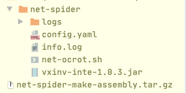
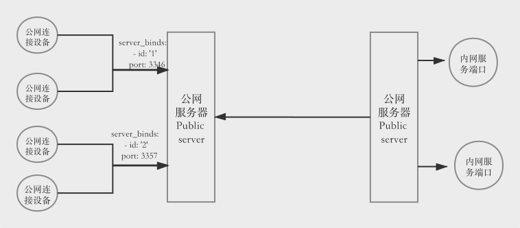

### 内网穿透软件介绍

#### 文件介绍

+ 下载文件,上传至服务器进行解压,tar或者zip包
   https://gitee.com/lixin888888/octor-net/releases/1.0
   
+ 解压目录如下图



+ 目录解释
    
    - logs 软件运行日志 默认等级是 warn
    - config.yaml 是配置文件
    - net-octor.sh 为命令脚本
    
#### 运行流程图



#### 配置文件介绍

```yaml

# 公网服务器端口
server_port: 4567
# 客户端链接公网服务器的端口 必须和server_port一致
client_connect_port: 4567
# 内网服务器访问公网的端口
client_connect_addr: 'aly1'
# 公网服务器监听端口
server_binds:
  # 如需监听多个 下面继续写 
  # 如下配置 公网服务监听 3310 3320
  - id: '1'
    port: 3310
  - id: '2'
    port: 3320
# 内网监听的端口
client_proxys:
  - id: '1'
    proxy_addr: '127.0.0.1'
    proxy_port: 8080
  - id: '2'
    proxy_addr: '127.0.0.1'
    proxy_port: 8080

```

+ server_port: 公网的服务器端口，内网服务器链接使用
+ client_connect_port: 配置内网链接公网的服务器端口，和上面的端口号保持一致
+ client_connect_addr: 配置公网服务器的链接地址
+ server_binds： 下面表示公网服务器监听的端口
+ port： 公网开放的端口
+ client_proxys： 下面表示内网服务器的穿透端口
+ proxy_addr: 内网的链接地址 ，默认可以配置主机自己
+ proxy_port: 内网的链接端口 


+ 注意事项：
    
    - server_binds id和client_proxys的id一一对应
    - 表示 公网访问3310会被代理到内网的8080
    - 配置文件是 yaml标记语言 :后留一个空格


#### 运行指令介绍

+ sh net-ocrot.sh  -start -s :公网服务器最后是-s 代表服务端  start表示开启服务 
+ sh net-ocrot.sh  -start -c : 内网服务器最后是-c 代表客户端  start表示开启服务 
+ sh net-ocrot.sh  -stop : 关闭服务


#### 使用场景

+ 代理基于TCP链接 可以代理HTTP SSL。。。
+ 内网运行时，内网的监听端口需要打开，比如代理内网的9090端口，那么内网的端口
一定要提前打开！！！！！


